⚠️⚠️⚠️⚠️⚠️⚠️⚠️
Note: As of Febuary 2, 2026 all of this replaced with [Nexus](https://www.sonatype.com/products/sonatype-nexus-repository). Since originally creating this our needs changed from needing just a container registry cache to need an aptitude package cache and much more.

# aio-harbor-registry-cache

## Overview
An all-in-one Harbor registry cache setup with OpenTofu configuration for managing container registry proxies. Supports both CORE and REPLICA deployment modes for distributed caching architectures. More details about the implementation can be found here: https://glueops.github.io/aio-harbor-registry-cache/

## Architecture

This project implements a tiered Harbor registry cache architecture with both CORE and REPLICA deployment modes for distributed caching across multiple data centers.

### High-Level Architecture Overview


### CORE Harbor Node Architecture

```mermaid
graph TB
    subgraph "External"
        DockerHub[Docker Hub]
        GHCR[GitHub Registry]
        Quay[Quay.io]
        Route53[Route53 Health Check]
    end
    
    subgraph "CORE Harbor Node"
        Client[Client Request<br/>:443/proxy-docker-io/image:tag]
        Nginx[Nginx Proxy<br/>TLS Termination<br/>443 → 8443]
        Harbor[Harbor Core<br/>:8443]
        HealthCheck[Health Check Service<br/>:1337<br/>Monitors Harbor Health]
        Storage[(Data Volume<br/>180-day cache<br/>⚠️ Rebuilt on updates)]
    end
    
    Client --> Nginx
    Nginx --> Harbor
    Harbor --> Storage
    Route53 --> HealthCheck
    HealthCheck -.->|Queries /api/v2.0/health| Harbor
    Harbor -.->|Cache Miss| DockerHub
    Harbor -.->|Cache Miss| GHCR
    Harbor -.->|Cache Miss| Quay
    
    classDef external fill:#fff3e0,stroke:#e65100,stroke-width:2px
    classDef proxy fill:#e8f5e8,stroke:#1b5e20,stroke-width:2px
    classDef harbor fill:#e1f5fe,stroke:#01579b,stroke-width:2px
    classDef storage fill:#f3e5f5,stroke:#4a148c,stroke-width:2px
    classDef health fill:#fff8e1,stroke:#f57f17,stroke-width:2px
    
    class DockerHub,GHCR,Quay,Route53 external
    class Nginx proxy
    class Harbor harbor
    class Storage storage
    class HealthCheck health
```



### REPLICA Harbor Node Architecture

```mermaid
graph TB
    subgraph "CORE Harbor"
        CoreHarbor[CORE Harbor Instance<br/>harbor-core.domain.com]
    end
    
    subgraph "External"
        Route53[Route53 Health Check]
    end
    
    subgraph "REPLICA Harbor Node"
        Client[Client Request<br/>replica-1.mirror.gpkg.io/proxy-docker-io/nginx:latest]
        Nginx[Nginx Proxy<br/>Path Rewriting/Proxying<br/><br/>🔄 /proxy-docker-io/nginx:latest<br/>↓<br/>/proxy-docker-io/proxy-docker-io/nginx:latest]
        Harbor[Harbor Replica<br/>:8443]
        HealthCheck[Health Check Service<br/>:1337<br/>Monitors Harbor Health]
        Storage[(Data Volume<br/>14-day cache<br/>⚠️ Rebuilt on updates)]
    end
    
    Client --> Nginx
    Nginx --> Harbor
    Harbor --> Storage
    Route53 --> HealthCheck
    HealthCheck -.->|Queries /api/v2.0/health| Harbor
    Harbor -.->|Cache Miss<br/>No Direct Upstream| CoreHarbor
    
    note1[❌ No Direct Connection<br/>to External Registries]
    note1 -.-> Harbor
    
    classDef core fill:#e1f5fe,stroke:#01579b,stroke-width:2px
    classDef proxy fill:#e8f5e8,stroke:#1b5e20,stroke-width:2px
    classDef replica fill:#f3e5f5,stroke:#4a148c,stroke-width:2px
    classDef storage fill:#f3e5f5,stroke:#4a148c,stroke-width:2px
    classDef warning fill:#ffebee,stroke:#c62828,stroke-width:2px
    classDef health fill:#fff8e1,stroke:#f57f17,stroke-width:2px
    classDef external fill:#fff3e0,stroke:#e65100,stroke-width:2px
    
    class CoreHarbor core
    class Nginx proxy
    class Harbor replica
    class Storage storage
    class note1 warning
    class HealthCheck health
    class Route53 external
```



### CORE Mode
- Points directly to upstream registries (docker.io, quay.io, ghcr.io, etc.)
- Serves as the primary cache tier with 180-day retention
- Deployed across multiple data centers for high availability
- Configured with `TF_VAR_harbor_registry_mode="CORE"`

### REPLICA Mode  
- Points to CORE Harbor instances instead of upstream registries
- Creates a tiered caching architecture for reduced bandwidth and improved performance
- Maintains a 14-day cache for regional distribution
- Configured with `TF_VAR_harbor_registry_mode="REPLICA"`

### Immutable Deployment Model
Both CORE and REPLICA nodes follow an immutable deployment pattern:
- **Data Volumes**: Cache data is stored in Docker volumes but gets rebuilt during updates
- **Configuration Updates**: Any configuration changes require a full rebuild
- **Cache Warming**: After updates, caches need to warm up again as they start empty
- **High Availability**: Multiple nodes ensure service continuity during rolling updates

### Nginx Proxy Layer
Each Harbor deployment includes an Nginx proxy that serves multiple critical functions:

- **TLS Termination**: Handles TLS 1.3 encryption and modern security headers
- **Port Translation**: Proxies from standard HTTPS port 443 to Harbor's 8443
- **Path Rewriting & Proxying** (REPLICA only): Transforms client requests to match Harbor's proxy project structure and does a Proxy to Harbor
- **HTTP to HTTPS Redirect**: Ensures all traffic is encrypted

#### REPLICA Path Rewriting Example
REPLICA nodes require special nginx path rewriting because Harbor's proxy projects expect duplicated path segments:

```
Client Request:
docker pull replica-1.mirror.gpkg.io/proxy-docker-io/nginx:latest

Nginx Transformation:
Input:  /proxy-docker-io/nginx:latest
Output: /proxy-docker-io/proxy-docker-io/nginx:latest
```

This rewriting ensures that Harbor's `proxy-docker-io` project correctly receives requests with the expected path structure.

### DNS-Based Load Balancing
The architecture uses DNS for service discovery and load balancing:

- **Geo-based Routing**: Route clients to the nearest available instance
- **Health Checks**: Automatic failover when nodes become unavailable using Route53 health checks on port 1337
- **Round Robin Distribution**: Distribute load across available CORE nodes
- **Cost Effective**: Eliminates need for dedicated load balancers

**Health Check Integration**: Route53 monitors the custom health check service on port 1337, which provides accurate Harbor health status by interpreting the Harbor API response payload, enabling reliable DNS failover.

### OIDC Authentication Challenges

#### Local Development Limitations
Testing OIDC authentication locally presents several challenges:

- **Callback URL Requirements**: OIDC providers require publicly accessible callback URLs
- **Devtunnel Limitations**: While devtunnels provide public URLs, they can be unstable for OIDC flows
- **Certificate Validation**: Self-signed certificates cause OIDC validation issues
- **Port Mapping Complexity**: The nginx proxy layer adds complexity to local OIDC testing

#### Recommended Testing Approach: VPS Deployment
**✅ Best Practice**: Deploy to a VPS with proper DNS and certificates for OIDC testing because:

- **Stable Public URLs**: Real domain names work reliably with OIDC providers
- **Valid TLS Certificates**: Let's Encrypt or other CA-issued certificates prevent validation issues  
- **Consistent Networking**: No tunnel instability or port mapping complications
- **Production Parity**: Testing environment matches production deployment closely

#### OIDC Configuration
The system supports Google OIDC for administrative access:
- `TF_VAR_GOOGLE_OIDC_CLIENT_ID`: Google OAuth client ID
- `TF_VAR_GOOGLE_OIDC_CLIENT_SECRET`: Google OAuth client secret
- Authentication is disabled for image pulls to ensure frictionless cluster bootstrapping

## Network Requirements

All TCP ports must be open for proper operation:

| Port | Service | Purpose | Accessibility |
|------|---------|---------|---------------|
| 80 | Nginx HTTP | HTTP traffic (Proxy to 8443 via 443) | External |
| 443 | Nginx HTTPS | HTTPS traffic (Proxy to 8443) | External |
| 8080 | Harbor HTTP | Harbor internal HTTP (Proxy to 8443) | Internal |
| 8443 | Harbor HTTPS | **Main Harbor service endpoint** | Internal |
| 1337 | Health Check | Route53 DNS health monitoring (infrastructure only) | External |

### Port Flow
```
Client Request → Port 80/443 (Nginx) → Port 8443 (Harbor)
Route53 Health Check → Port 1337 (Health Check Service) → Port 8443 (Harbor Health API)
```

**Note**: Docker clients and Kubernetes automatically follow redirects, so requests to `replicas.mirror.gpkg.io` flow: `80/443 → 443` for every image pull. Clients never interact with port 1337 - it's purely for DNS failover.

## Health Check Service (Port 1337)

Harbor's built-in health check always returns HTTP 200, even when components are unhealthy. To enable proper DNS failover with Route53, a custom health check service runs on **port 1337** that:

- Queries Harbor's `/api/v2.0/health` endpoint 
- Interprets the JSON response payload
- Returns **HTTP 503** if ANY Harbor component reports as "unhealthy"
- Returns **HTTP 200** only when all Harbor components are healthy
- Enables Route53 to automatically failover to healthy instances

**Important**: This is purely infrastructure-level monitoring. Docker clients, Kubernetes clusters, and developers never interact with this port - they only use ports 80/443 for image pulls.

### Testing the Health Check (Infrastructure/Operations Only)
```bash
# Test health check directly on root path
curl http://your-harbor-host:1337/

# Expected responses:
# HTTP 200 - All Harbor components healthy
# HTTP 503 - One or more Harbor components unhealthy or Harbor unreachable
```

## Server Requirements

- Debian 12
- Docker installed:
```bash
curl -fsSL https://get.docker.com -o get-docker.sh
sudo sh get-docker.sh
sudo apt update -y
sudo apt install -y git zip unzip
git clone https://github.com/GlueOps/aio-harbor-registry-cache.git
cd aio-harbor-registry-cache
```

## Usage

### Development/CI Environments
```bash
# Local development
./setup.sh --env=local

# GitHub Actions CI
./setup.sh --env=github
```

### Production Deployments
```bash
# Deploy CORE Harbor instance
./setup.sh --env-file=core.env.example

# Deploy REPLICA Harbor instance
./setup.sh --env-file=replica.env.example

# Use custom environment file
./setup.sh --env-file=my-production.env
```

## Configuration

### Environment Files
- `config/local.env` - Local development settings (ignored in git)
- `config/github.env` - GitHub Actions CI settings (ignored in git)
- `config/core.env.example` - CORE Harbor template
- `config/replica.env.example` - REPLICA Harbor template

### Setting Up New Environments
1. Copy the appropriate template file:
   ```bash
   # For CORE Harbor
   cp config/core.env.example config/my-core.env
   
   # For REPLICA Harbor
   cp config/replica.env.example config/my-replica.env
   ```
2. Edit the new file with your environment-specific values
3. Use with: `./setup.sh --env-file=my-core.env`

### Required Environment Variables
- `HARBOR_HOSTNAME` - Harbor server hostname
- `HARBOR_DATA_VOLUME_PATH` - Data volume path
- `HARBOR_HTTPS_ENABLED` - Enable/disable HTTPS (true/false)
- `HARBOR_NGINX_CERT_LOCATION` - SSL certificate location (if HTTPS enabled)
- `HARBOR_NGINX_KEY_LOCATION` - SSL private key location (if HTTPS enabled)
- `HARBOR_URL` - Harbor server URL for OpenTofu
- `TF_VAR_harbor_registry_mode` - Registry mode: "CORE" or "REPLICA"
- `TF_VAR_harbor_core_hostname` - CORE Harbor hostname (required for REPLICA mode)

### Optional Environment Variables
- `CREATE_LOCAL_CERTS` - Generate local self-signed certificates (true/false, default: false)


## Registry Proxy Projects
The script automatically creates proxy projects for major registries. The behavior differs between CORE and REPLICA modes:

- **CORE Mode**: Points directly to upstream registry endpoints
- **REPLICA Mode**: Points to corresponding CORE Harbor proxy projects

| Registry | CORE Mode Endpoint | REPLICA Mode Endpoint | Project Name |
|----------|-------------------|----------------------|--------------|
| Docker Hub | `https://registry-1.docker.io` | `https://{CORE_HOSTNAME}/proxy-docker-io` | `proxy-docker-io` |
| GitHub Container Registry | `https://ghcr.io` | `https://{CORE_HOSTNAME}/proxy-ghcr-io` | `proxy-ghcr-io` |
| Quay.io | `https://quay.io` | `https://{CORE_HOSTNAME}/proxy-quay-io` | `proxy-quay-io` |
| Google Container Registry | `https://gcr.io` | `https://{CORE_HOSTNAME}/proxy-gcr-io` | `proxy-gcr-io` |
| AWS Public ECR | `https://public.ecr.aws` | `https://{CORE_HOSTNAME}/proxy-public-ecr-aws` | `proxy-public-ecr-aws` |
| Microsoft Container Registry | `https://mcr.microsoft.com` | `https://{CORE_HOSTNAME}/proxy-mcr-microsoft-com` | `proxy-mcr-microsoft-com` |
| Kubernetes Registry | `https://registry.k8s.io` | `https://{CORE_HOSTNAME}/proxy-registry-k8s-io` | `proxy-registry-k8s-io` |

